# DarkTon
DarkTon, kullanıcıların favori webtoon'larını keşfetmelerine, okumalarına ve kaydetmelerine olanak tanıyan bir mobil uygulamadır. Bu uygulama ile webtoon'ları rahatça takip edebilir ve kişisel profilinizde favorilerinizi yönetebilirsiniz.

## İçindekiler
1. [Özellikler](#özellikler)
2. [Ekran Görüntüleri](#ekran-görüntüleri)
  - Login
  - Signup
  - Ana Sayfa
  - Keşfet
  - Kaydedilenler
  - Profil
  - Webtoon Bilgi
  - Webtoon Okuma
  - Ayarlar
  - Ana Sayfa Yüklenme Ekranı
  - Keşfet Yüklenme Ekranı
3. [Katkıda Bulunma](#katkıda-bulunma)

## Özellikler
DarkTon, kullanıcıların favori webtoon'larını keşfetmelerine, okumalarına ve kaydetmelerine olanak tanıyan bir mobil uygulamadır. DarkTon'un sunduğu özellikler şunlardır:

- **Kullanıcı Girişi ve Kaydı:** Kullanıcılar DarkTon'a giriş yapabilir veya yeni bir hesap oluşturabilirler.
  
- **Kişiselleştirilmiş Ana Sayfa:** Kullanıcılar, tercihlerine göre özelleştirilmiş bir ana sayfa üzerinde favori webtoon'larına ve yeni çıkanlara göz atabilirler.

- **Webtoon Keşfetme:** Kullanıcılar, kapsamlı bir arama özelliği ve keşfetme ekranı aracılığıyla yeni webtoon'lar keşfedebilirler.

- **Favori Webtoon'ları Kaydetme:** Kullanıcılar, beğendikleri webtoon'ları kolayca favorilere ekleyebilir ve daha sonra erişebilirler.

- **Kullanıcı Profili Yönetimi:** Kullanıcılar, profil sayfaları üzerinden hesap bilgilerini yönetebilir ve favorilere ekledikleri webtoon'ları görüntüleyebilirler.

- **Detaylı Webtoon Bilgi Sayfası:** Kullanıcılar, her webtoon için detaylı bilgilere erişebilirler. Bu bilgiler arasında webtoon'un kapak resmi, konusu, beğenilme ve kaydedilme sayıları, bölümler ve yapılan yorumlar bulunmaktadır.

- **Kullanıcı dostu arayüz ve akıcı okuma deneyimi sunar:** Kullanıcılar, DarkTon'un kullanıcı dostu arayüzü sayesinde webtoon'ları rahatça okuyabilirler. Ayrıca, okudukları bölüme yorum yapma imkanına da sahiptirler.

- **Uygulama Ayarları Yönetimi:** Kullanıcılar, tercihlerini yönetmek için geniş bir ayarlar menüsüne erişebilirler. Bu ayarlar arasında şifre sıfırlama, tema seçimi ve diğer tercihler bulunmaktadır.

## Ekran Görüntüleri

1. Giriş Ekranı
   <table>
     <tr>
       <td>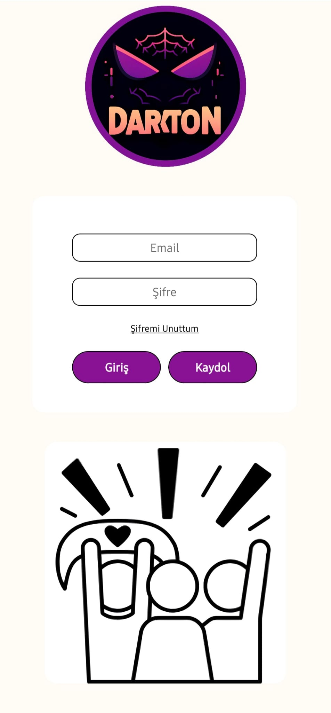</td>
       <td>Giriş ekranı, kullanıcıların hesaplarına erişmek için kullanılan ilk adımdır. Aynı zamanda şifrelerini unutan kullanıcıların şifre sıfırlama isteğini "Şifremi Unuttum" butonu ile gerçekleştirebilir.</td>
     </tr>
   </table>

2. Kayıt Ekranı
   <table>
     <tr>
       <td>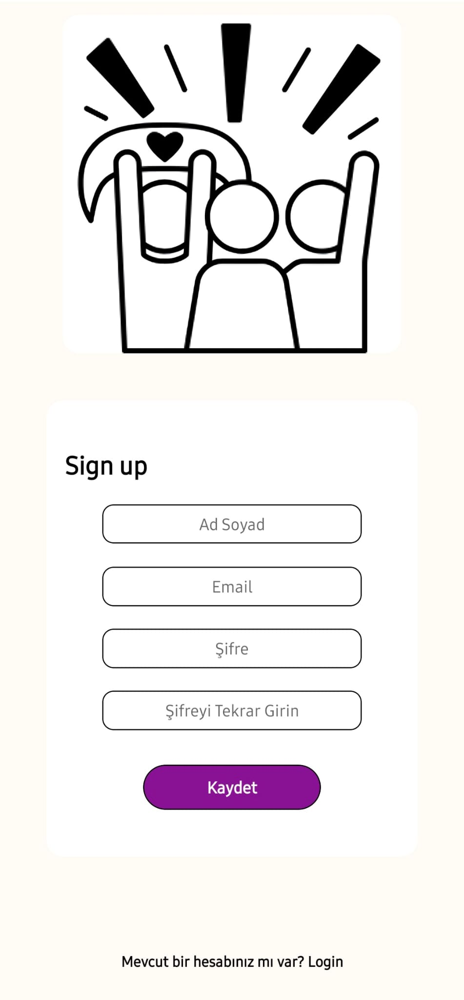</td>
       <td>Kayıt ekranı, yeni kullanıcıların hesap oluşturduğu yerdir.</td>
     </tr>
   </table>

3. Ana Sayfa
   <table>
     <tr>
       <td>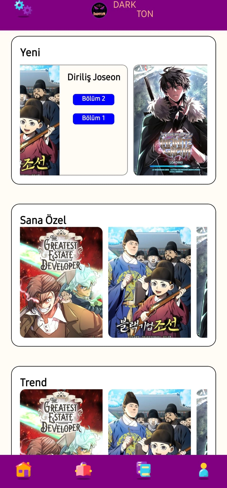</td>
       <td>Ana sayfa, kullanıcının favori webtoon'larına erişebileceği bir genel bakış sunar. Yeni webtoonlar, kişisel webtoonlar ve trend webtoonlar burada listelenir.</td>
     </tr>
   </table>

4. Keşfet Ekranı
   <table>
     <tr>
       <td>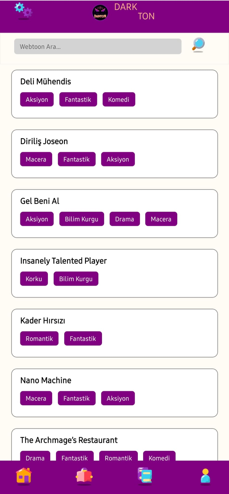</td>
       <td>Keşfet ekranı, kullanıcının yeni webtoon'lar keşfetmesine olanak sağlar. İsterse kullanıcılar arama özelliği ile istedikleri webtoonu arayabilir.</td>
     </tr>
   </table>

5. Kaydedilenler Ekranı
   <table>
     <tr>
       <td>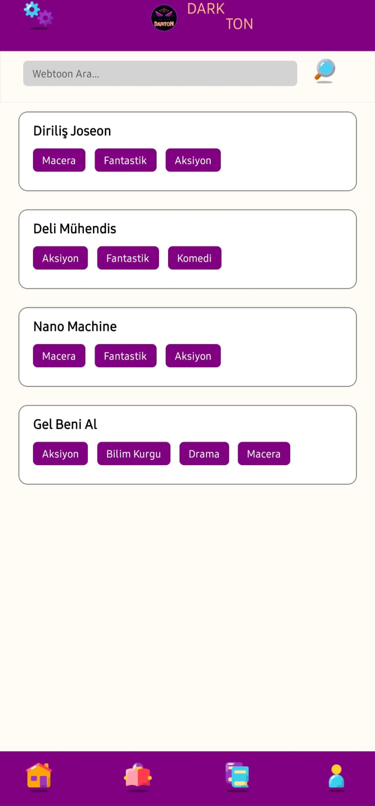</td>
       <td>Kaydedilenler ekranı, kullanıcının favori webtoon'larını sakladığı yerdir.</td>
     </tr>
   </table>

6. Profil Ekranı
   <table>
     <tr>
       <td>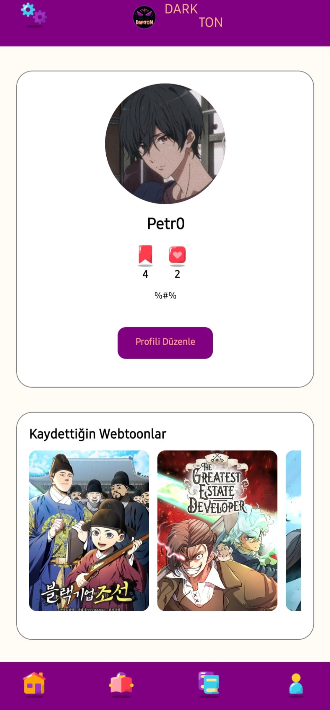</td>
       <td>Profil ekranı, kullanıcının hesap bilgilerini yönetebileceği bir alandır. Profil resmi, kullanıcı adı ve hakkımda kısmı burada sergilenir ve güncellenir. Favori kaydedilen webtoonların bir kısmı da listelenir.</td>
     </tr>
   </table>

7. Webtoon Bilgi Ekranı
   <table>
     <tr>
       <td>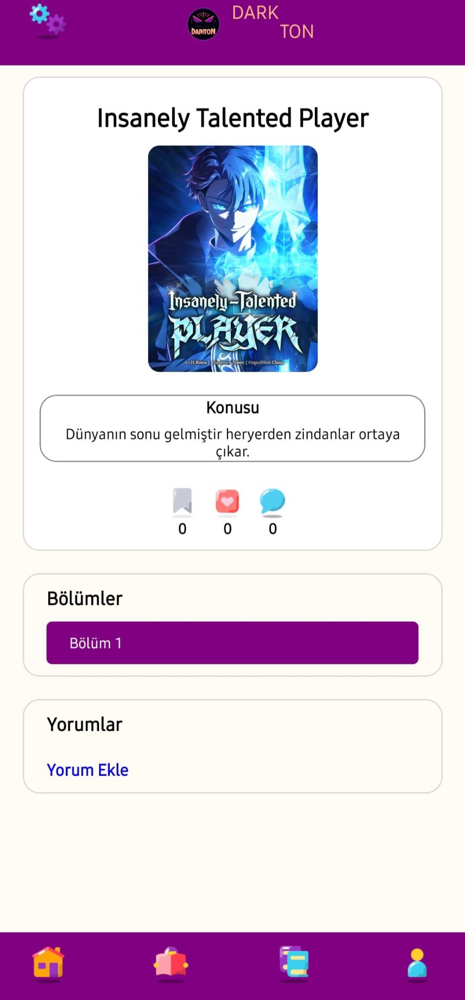</td>
       <td>Webtoon bilgi ekranı, kullanıcının belirli bir webtoon hakkında detaylı bilgilere erişebileceği yerdir. Kapak resmi, konusu, beğenilme ve kaydedilme sayısı, bölümler ve webtoona yapılan yorumlar bu sayfada yer alır.</td>
     </tr>
   </table>

8. Webtoon Okuma Ekranı
   <table>
     <tr>
       <td>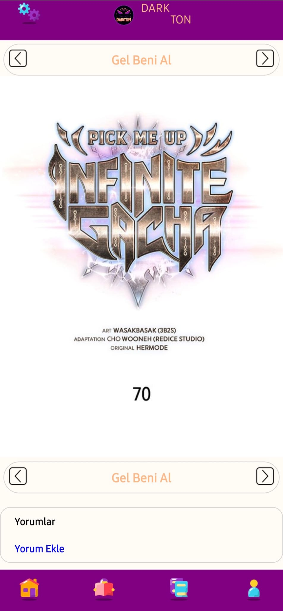</td>
       <td>Webtoon okuma ekranı, kullanıcının webtoon'ları rahatça okuyabileceği bir arayüzdür. Webtoon bölümlerini okuyabilir ve okuduğu bölüme yorum yapabilir.</td>
     </tr>
   </table>

9. Ayarlar Ekranı
   <table>
     <tr>
       <td>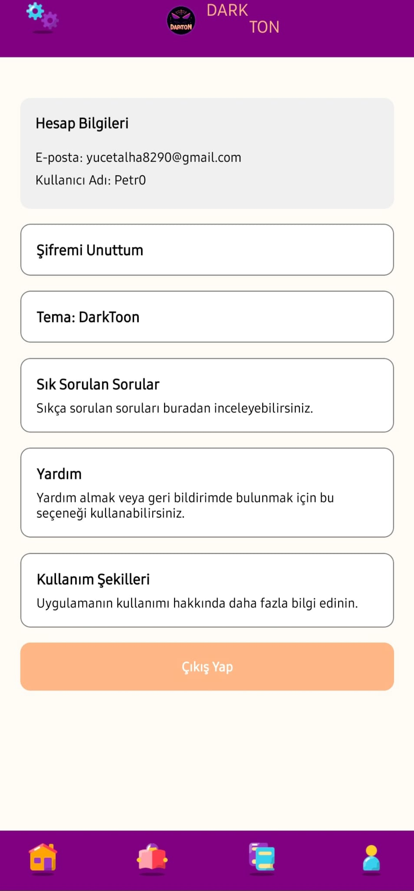</td>
       <td>Ayarlar ekranı, uygulama tercihlerini ve ayarlarını yönetmek için kullanılır. Şifremi unuttum ile şifre sıfırlama isteği. Tema değiştirme ile "Açık Tema", "Koyu Tema" ve "DarkTon" temaları arasında değişebilir. Resimler "DarkTon" tema altında gösterilmiştir.</td>
     </tr>
   </table>

10. Ana Sayfa Yüklenme Ekranı
    <table>
      <tr>
        <td>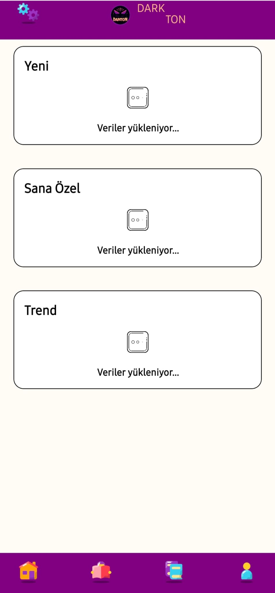</td>
        <td>Ana sayfa yüklenme ekranı, kullanıcının ana sayfanın yüklenmesini beklediği sırada görülen ekranı temsil eder. Webtoon Bilgileri alınırken kullanılan arayüz.</td>
      </tr>
    </table>

11. Keşfet Yüklenme Ekranı
    <table>
      <tr>
        <td>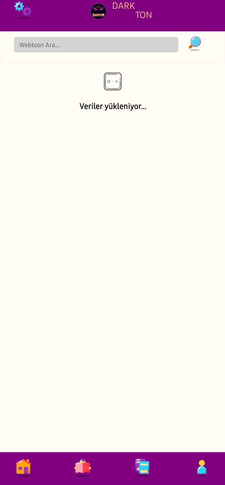</td>
        <td>Keşfet yüklenme ekranı, kullanıcının keşfet sayfasının yüklenmesini beklediği sırada görülen ekranı temsil eder.</td>
      </tr>
    </table>

## Katkıda Bulunma
Bu projeye katkı yapmak isterseniz, aşağıdaki adımları izleyebilirsiniz.

### Nasıl Katkı Yapılır

1. Bu projeyi fork'layın.
2. Kendi bilgisayarınıza fork'ladığınız projeyi klonlayın.
3. Yapmak istediğiniz değişiklikleri yapın.
4. Değişikliklerinizi commit edin ve açıklayıcı bir mesaj ile commit mesajınızı yazın.
5. Değişikliklerinizi kendi fork'ladığınız projeye push'layın.
6. GitHub üzerinden bu projeye bir Pull Request (PR) gönderin.

### Pull Request (PR) Kuralları

- PR'ınızı açıklamak için açıklayıcı bir başlık ve açıklama ekleyin.
- Tek bir PR içinde sadece bir konuya odaklanın.
- Kodunuzu düzenli tutun ve gerektiğinde yorumlar ekleyin.
- Herhangi bir ek veya değişiklik yaptığınızda belgelendirmeyi unutmayın.

### İletişim

Herhangi bir sorunuz, geri bildiriminiz veya katkı yapmak istiyorsanız, lütfen bana e-posta yoluyla ulaşın:
[yucetalha8290@gmail.com](mailto:yucetalha8290@gmail.com.)
